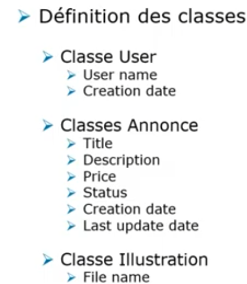

1. Modélisation du projet
- Nous allons choisir les entités qui vont définir notre projet
2. Définition des classes
   - ces classes vont allées créer les tables en base de données
- 
3. Contraintes
4. Scaffolding